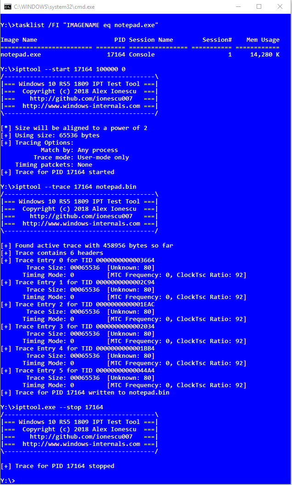

# WinIPT
The Windows Library for Intel Process Trace (WinIPT) is a project that leverages the new Intel Processor Trace functionality exposed by Windows 10 Redstone 5 (1809), currently in the Windows Insider Preview (WIP). The new operating system now includes the old inbox Intel PT driver (ipt.sys) with additional code that allows configuring both per-process and per-core tracing through an IOCTL and registry mechanism, instead of relying on undocumented ETW internals. In this repository, you will find the following 3 projects:

* `libipt`
This is the Win32 API version of the library which grants access to the IPT Driver/Service IOCTLs that enable per-core and per-process tracing with the new facilities exposed by Windows. This library uses Win32 semantics & notation, and its functions are re-implementations of some of the functions that were found in Dbghelp.dll, Dbgcore.dll, Faultrep.dll and Ntdll.dll.

* `libiptnt`
This is the native NT API version of the same library as above, which uses only Ntdll.dll functions, making it suitable for use in Native/non-Win32 applications. This library uses NT-style semantics & notication, and its functions are almost identical to the ones exposed by the libraries listed above.

* `ipttool`
This acts as a sample for the libipt static library referenced above, and provides a simple CLI utility around starting, stopping, and querying traces for a given process. It does not currently support core tracing, and it does not do decoding -- please use the Intel PT library for that.

## Screenshot



## Motivation

## References

For some highly recommended reading on Intel Processor Trace, I recommend reading the following presentations from Richard Johnson & Andrea Alevi:  [ref1](https://googleprojectzero.blogspot.com/2018/01/reading-privileged-memory-with-side.html),  [ref2](https://googleprojectzero.blogspot.com/2018/01/reading-privileged-memory-with-side.html),  [ref3](https://googleprojectzero.blogspot.com/2018/01/reading-privileged-memory-with-side.html) as well as this presentation: [ref4](https://googleprojectzero.blogspot.com/2018/01/reading-privileged-memory-with-side.html) by Matt Spisak. Other relevant research can be found [here](https://googleprojectzero.blogspot.com/2018/01/reading-privileged-memory-with-side.html) and [here](https://googleprojectzero.blogspot.com/2018/01/reading-privileged-memory-with-side.html).

If you would like to know more about my research or work, I invite you to check out my blog at [http://www.alex-ionescu.com](http://www.alex-ionescu.com) as well as my training & consulting company, Winsider Seminars & Solutions Inc., at [http://www.windows-internals.com](http://www.windows-internals.com).

## License

```
Copyright 2018 Alex Ionescu. All rights reserved. 

Redistribution and use in source and binary forms, with or without modification, are permitted provided
that the following conditions are met: 
1. Redistributions of source code must retain the above copyright notice, this list of conditions and
   the following disclaimer. 
2. Redistributions in binary form must reproduce the above copyright notice, this list of conditions
   and the following disclaimer in the documentation and/or other materials provided with the 
   distribution. 

THIS SOFTWARE IS PROVIDED BY ALEX IONESCU ``AS IS'' AND ANY EXPRESS OR IMPLIED
WARRANTIES, INCLUDING, BUT NOT LIMITED TO, THE IMPLIED WARRANTIES OF MERCHANTABILITY AND
FITNESS FOR A PARTICULAR PURPOSE ARE DISCLAIMED. IN NO EVENT SHALL ALEX IONESCU
OR CONTRIBUTORS BE LIABLE FOR ANY DIRECT, INDIRECT, INCIDENTAL, SPECIAL, EXEMPLARY, OR
CONSEQUENTIAL DAMAGES (INCLUDING, BUT NOT LIMITED TO, PROCUREMENT OF SUBSTITUTE GOODS
OR SERVICES; LOSS OF USE, DATA, OR PROFITS; OR BUSINESS INTERRUPTION) HOWEVER CAUSED
AND ON ANY THEORY OF LIABILITY, WHETHER IN CONTRACT, STRICT LIABILITY, OR TORT (INCLUDING
NEGLIGENCE OR OTHERWISE) ARISING IN ANY WAY OUT OF THE USE OF THIS SOFTWARE, EVEN IF
ADVISED OF THE POSSIBILITY OF SUCH DAMAGE.

The views and conclusions contained in the software and documentation are those of the authors and
should not be interpreted as representing official policies, either expressed or implied, of Alex Ionescu.
```
